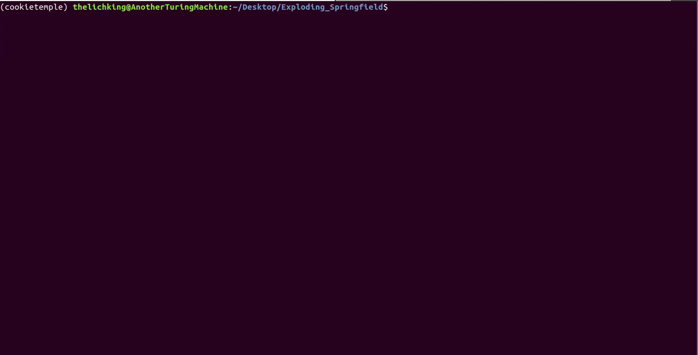
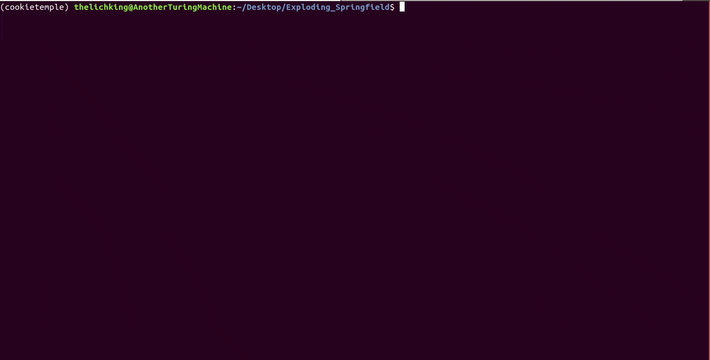
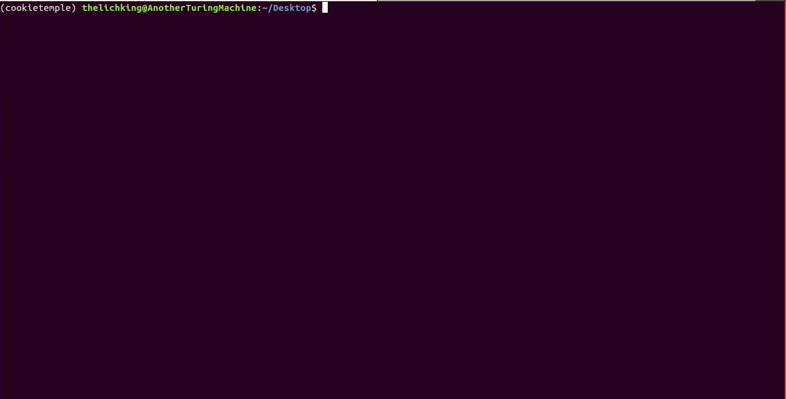
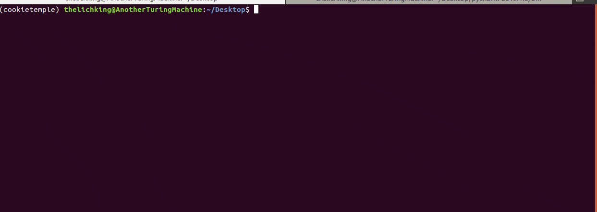

|pic1|

.. |pic1| image:: https://user-images.githubusercontent.com/21954664/83797925-a7019400-a6a3-11ea-86ad-44ad00e24234.png
   :width: 75%

-----------------------------------------------------------

|

.. image:: https://github.com/zethson/cookietemple/workflows/Build%20Cookietemple%20Package/badge.svg
        :target: https://github.com/zethson/cookietemple/workflows/Build%20Cookietemple%20Package/badge.svg
        :alt: Github Workflow Build cookietemple Status

.. image:: https://github.com/zethson/cookietemple/workflows/Run%20Cookietemple%20Tox%20Test%20Suite/badge.svg
        :target: https://github.com/zethson/cookietemple/workflows/Run%20Cookietemple%20Tox%20Test%20Suite/badge.svg
        :alt: Github Workflow Tests Status

.. image:: https://img.shields.io/pypi/v/cookietemple.svg
        :target: https://pypi.python.org/pypi/cookietemple
        :alt: PyPi Status

.. image:: https://readthedocs.org/projects/cookietemple/badge/?version=latest
        :target: https://cookietemple.readthedocs.io/en/latest/?badge=latest
        :alt: Documentation Status

.. image:: https://codecov.io/gh/Zethson/cookietemple/branch/master/graph/badge.svg?token=dijn0M0p7m
        :target: https://codecov.io/gh/Zethson/cookietemple
        :alt: Codecov Status

.. image:: https://flat.badgen.net/dependabot/thepracticaldev/dev.to?icon=dependabot
        :target: https://flat.badgen.net/dependabot/thepracticaldev/dev.to?icon=dependabot
        :alt: Dependabot Enabled

.. image:: https://img.shields.io/discord/708008788505919599?color=passing&label=Discord%20Chat&style=flat-square
        :target: https://discord.gg/PYF8NUk
        :alt: Discord

.. image:: https://img.shields.io/twitter/follow/cookiejarorg?color=green&style=flat-square
        :target: https://twitter.com/cookiejarorg
        :alt: Twitter Follow

A cookiecutter based project template creation tool supporting several domains and languages with advanced linting, syncing and standardized workflows to get your project kickstarted in no time.

* Free  and open-source software: Apache 2.0
* Documentation: https://cookietemple.readthedocs.io .

Installing
---------------

Start your journey with cookietemple by installing it via :code:`$ pip install cookietemple`.

Cookietemple
============

Create
------
Kickstart your customized project with one of cookietemple's templates in no time.

Sync
------
Sync your project with the latest cookietemple release to ensure you are up to date.

Lint
----
Use advanced linting to ensure your project always adheres to common standards.

Bump-Version
------------
Bump your project version with many configurable options.

Config
------
Configure your cookietemple settings to ensure you are not always asked for the same thing.

List
----
List all available cookietemple templates with short info for each.

Info
----
Get detailed information on a cookietemple template.

Warp
----
Create a self contained executable.
Currently, cookietemple does not ship any templates, where this may be required.

Upgrade
-------
Check whether you are using the latest cookietemple version and update automatically to benefit from the latest features.

Projects using cookietemple
---------------------------
A few of those projects using cookietemple are listed below:

* `<https://github.com/mlf-core/system-intelligence>`_
* `<https://github.com/mlf-core/mlf-core>`_
* `<https://github.com/cookiejar/cookietemple_website>`_

Contributing
------------

cookietemple is a huge open-source effort and highly welcomes all contributions! Join our `Discord Channel <https://discord.gg/PYF8NUk>`_.
Please read :ref:`contributing`  to find out how you can contribute.

Authors
-------

cookietemple was initiated and developed by `Lukas Heumos (Github)  <https://github.com/zethson>`_ and `Philipp Ehmele (Github) <https://github.com/imipenem>`_.
