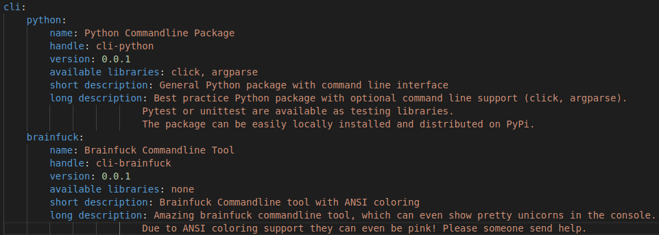
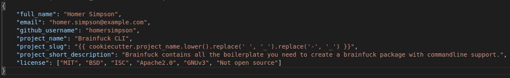
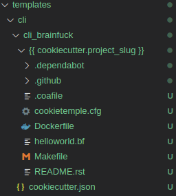
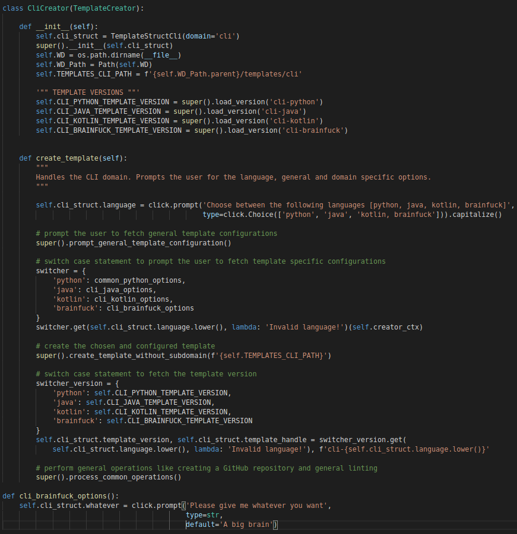
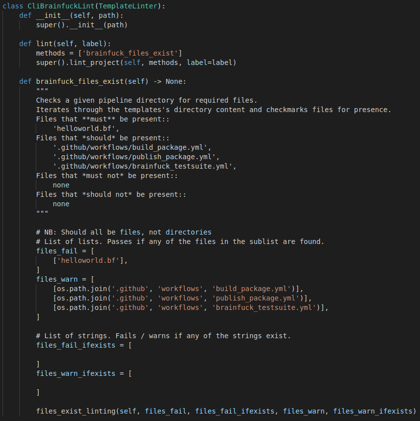
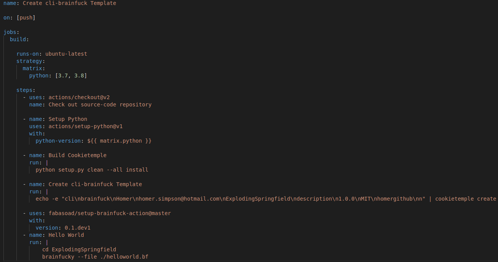

.. _adding_templates:

============================
Adding new templates
============================

Adding new templates is one of the major improvements and community contributions to COOKIETEMPLE, which is why we are dedicating a whole section to it.
Please note that creating new templates is a time consuming task. So be prepared to invest a few hours to bring a new template to life.
The integration into COOKIETEMPLE however, is straight forward if you follow the guide below.
Due to the tight coupling of our templates with all COOKIETEMPLE commands such as :code:`create`, :code:`list`, :code:`info`, :code:`lint` and :code:`bump-version`,
new templates require the modification of several files.

COOKIETEMPLE uses `cookiecutter <https://cookiecutter.readthedocs.io/en/1.7.2/>`_ to create all templates.
You need to familiarize yourself beforehand with cookiecutter to able to write templates, but don't worry, it's pretty easy and you usually get by with very few cookiecutter variables.
You can start with you `very first cookiecutter template <https://cookiecutter.readthedocs.io/en/1.7.2/first_steps.html>`_ and then simply see how the other existing COOKIETEMPLE templates are made and copy what you need.

The following sections will line out the requirements for new templates and guide you through the process of adding new templates step by step.
Nevertheless, we strongly encourage you to discuss your proposed template first with us in public *via* a Github issue.

Template requirements
-----------------------
To keep the standard of our templates high we enforce several standards, to which all templates **must** adhere.
Exceptions, where applicable, but they would have to be discussed beforehand. Hence, the term *should*.

1. | New templates should be novel.
   | We do not want a second cli-python template, but you are of course always invited to improve it. A new commandline library does not warrant an additional template, but rather modifications of the existing template with cookiecutter if statements.
   | However, distinct modifications of already existing templates may be eligible. An example would be to add a GUI template for a language, which does not yet have a GUI template.
   | Templates for domains, which we do not yet cover or additional languages to already existing domains are of course more than welcome.

2. | All templates should be cutting edge and not be based on technical debt or obscure requirements. Our target audience are enthusiastic open source contributors and not decade old companies stuck with Python 2.7.

3. All templates should build as automatically as possible and download all dependencies without manual intervention.

4. All templates should have a testing and possibly mocking framework included.

5. | All templates should provide a readthedocs setup (include changelog and a codeofconduct), a README.rst file, a LICENSE, Github issue and pull request templates and a .gitignore file. Moreover, a .dependabot configuration should be present if applicable.
   | Note that most of these are already included in our common_files and do not need to be rewritten. More on that below.

6. All templates should provide a Makefile, which wraps heavily used commands to unify common operations such as installing, testing or distributing a project, independent of the language

7. All templates should have a Dockerfile, which provides an entrypoint for the project.

8. All templates must implement all required functionality to allow the application of all commands mentioned above to them, which includes a cookietemple.cfg file, the template being in the available_templates.yml and more.

9. All templates should have Github workflows, which at least build the documentation and the project.

10. Every template should also have a workflow inside COOKIETEMPLE, which creates a project from the template with dummy values.

11. Your template should support Linux and MacOS. Windows support is optional, but strongly encouraged.

Again, we strongly suggest that new templates are discussed with the core team first.

Step by step guide to adding new templates
------------------------------------------

Let's assume that we are planning to add a new commandline `Brainfuck <https://en.wikipedia.org/wiki/Brainfuck>`_ template to COOKIETEMPLE.
We discussed our design at length with the core team and they approved our plan. For the sake of this tutorial we assume that the path / always points to /cookietemple.
Hence, at this level we see :code:`cookietemple_cli.py` and a folder per CLI command.

1. Let's add our brainfuck template information to :code:`/create/templates/available_templates.yml`.

   Addition of a cli-brainfuck template to available_templates.yml.

2. | Next, we add our brainfuck template to :code:`/create/templates`
   | Note that it should adhere to the standards mentioned above and include all required files. Don't forget to edit the cookietemple.cfg file to facilitate bump-version. See :ref:`bump-version-configuration` for details.
    It is **mandatory** to name the top level folder ``{{ cookiecutter.project_slug }}``, which ensures that the project after creation will have a proper name.
    Furthermore, the ``cookiecutter.json`` file should have at least the following variables:

   cookiecutter.json file, which contains all variables that templates should have.

   File tree for our brainfuck template.

3. | Now it is time to subclass the :code:`TemplateCreator` to implement all required functions to create our template!
   | Let's edit :code:`/create/domains/CliCreator.py`. Note that for new domains you would simply create a new file called DomainCreator.
   | In this case we suggest to simply copy the code of an existing Creator and adapt it to the new domain. Your new domain may make use of other creation functions instead of :code:`create_template_without_subdomain`, if they for example contain subdomains. You can examine :code:`create/TemplatorCreator.py` to see what's available. You may also remove functions such as the creation of common files.
   | If we have any brainfuck specific cookiecutter variables that we need to populate, we may add them to the TemplateStructCli.
   | Our brainfuck templates does not have them, so we just leave it as is.
   | For the next step we simply go through the :code:`CliCreator` class and add our brainfuck template where required. Moreover, we implement a :code:`cli_brainfuck_options` function, which we use to prompt for template specific cookiecutter variables.

   CliCreator.py after adding our brainfuck template.

4. | If a new template were added we would also have to import our new Creator in :code:`create/create.py` and edit it accordingly.
   | However, in this case we can simply skip this step.

5. | Linting is up next! We need to ensure that our brainfuck template always adheres to the highest standards! Let's edit :code:`lint/domains/cli.py`.
   | We need to add a new class, which inherits from TemplateLinter and add our linting functions to it.

   Our new CliBrainfuckLinter, which lints our brainfuck template. Note that it inherits from TemplateLinter.

   We need to ensure that our new linting function is found when linting is applied. Therefore, we turn our eyes to :code:`lint/lint.py`, import our CliBrainfuckLinter and add it to the switcher.

.. figure:: images/adding_templates_step_5_2.png
   :scale: 100 %
   :alt: Available Templates Brainfuck example

   Our shiny new CliBrainfuckLinter is now ready for action!

6. | The only things that is left to do now is to add a new Github Actions workflow for our template. Let's go one level up in the folder tree and create :code:`.github/workflows/create_cli_brainfuck.yml`.
   | We want to ensure that if we change something in our template, that it still builds!

   We were pleasently surprised to see that someone already made a Github Action for brainfuck.

7. | Finally, we add some documentation to :code:`/docs/available_templates.rst` and explain the purpose, design and frameworks/libraries.

   That's it! We should now be able to try out your new template using :code:`cookietemple create`
   The template should be creatable, it should automatically lint after the creation and Github support should be enabled as well! If we run :code:`cookietemple list`
   Our new template should show up as well!
   I'm sure that you noticed that there's not actually a brainfuck template in COOKIETEMPLE (yet!).

   To quote our mighty Math professors: 'We'll leave this as an exercise to the reader.'
