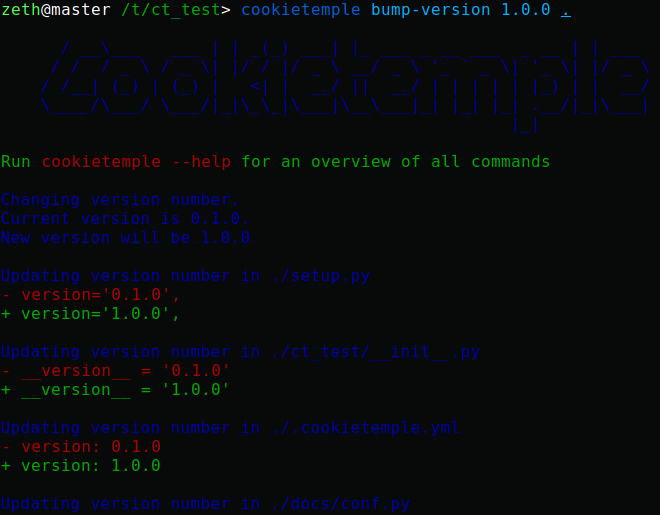

.. _bump-version:

==============================================
Bumping the version of an existing project
==============================================

Increasing the version of an already existing project is often times a cumbersome and error prone process, since the version has to be changed in multiple places.
To facilitate this process, cookietemple provides a ``bump-version`` command, which conveniently increases the version across several files and commits them.
Additionally, bump-version inserts a new section into the changelog using the specified new version.

.. code::

    New Version (Date)
    ------------------

    **Added**

    **Fixed**

    **Dependencies**

    **Deprecated**

bump-version will verify that your new version adheres to `semantic versioning <https://semver.org/>`_ and that you are not trying to update it unreasonably.
It is for example not allowed to bump from 2.0.0 to 7.1.2, since in a normal development workflow only 2.0.1, 2.1.0 or 3.0.0 adhere to consecutive `semantic versioning <https://semver.org/>`_.
Note that SNAPSHOT versions are allowed! However, it must still follow `semantic versioning <https://semver.org/>`_.
Version 1.2.5 therefore cannot be the predecessor of 1.2.5-SNAPSHOT, but only 1.2.4.

Usage
---------

The :code:`bump-version` command follows the syntax

.. code-block:: console

    $ cookietemple bump-version <OPTIONS> X.X.X <PATH>

- ``X.X.X`` : The new version, where the ``X`` correspond to integers adhering to consecutive `semantic versioning <https://semver.org/>`_. You may append ``-SNAPSHOT``.

- ``PATH`` [CWD]: The path to the ``cookietemple.cfg`` file, which contains all locations, where the version should be increased.

   bump-version applied to a fresh cli-python project

Note that you can use ``bump-version`` without passing any parameters. This way, cookietemple will let you choose from three valid options
to bump your projects version. Note that this will only work in the main directory of your project due to some cli constraints.

Flags
-------

- ``--downgrade`` : To downgrade a version.

  The changelog won't be modified. Only use this option as a last resort if something went horribly wrong in your development process. In a normal development workflow, this should never be necessary.

- ``--project-version`` : To get the current project version.

  No version bumping will be triggered. Using this flag will cancel any commands executed after and exits the program.

.. _bump-version-configuration:

Configuration
------------------

All templates of cookietemple ship with a ``cookietemple.cfg`` file, which defines all files ``bump-version`` examines.

The ``bump-version`` configuration begins with the section::

    [bumpversion]
    current_version = 0.1.0

where the current version is defined. All files are either white- or blacklisted (see below for explanations).
An arbitrary name is followed by the path to the file: ``arbitrary_name = path_to_file``.

Whitelisted files are listed below a ``[bumpversion_files_whitelisted]`` section, e.g.::

    [bumpversion_files_whitelisted]
    dot_cookietemple = .cookietemple.yml
    conf_py = docs/conf.py

All files, which are whitelisted are searched for patterns matching ``X.X.X``, which are updated to the specified new versions.
Any lines, which contain the string ``<<COOKIETEMPLE_NO_BUMP>>`` will be ignored.

If files, like Maven pom.xml files, contain many version patterns matching ``X.X.X``, it may be a better idea to blacklist them (section ``[bumpversion_files_blacklisted]``) and enable only specific lines to be updated::

    [bumpversion_files_blacklisted]
    pom = pom.xml

Analogously to whitelisted files, which allow for specific lines to be ignored, blacklisted files allow for specific lines to be forcibly updated using the string :code:`<<COOKIETEMPLE_FORCE_BUMP>>`.

Note that those tags must be on the same line as the version (commonly placed in a comment), otherwise they wont work!
