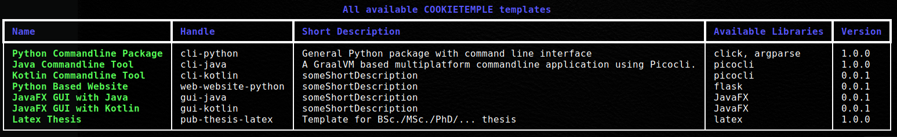
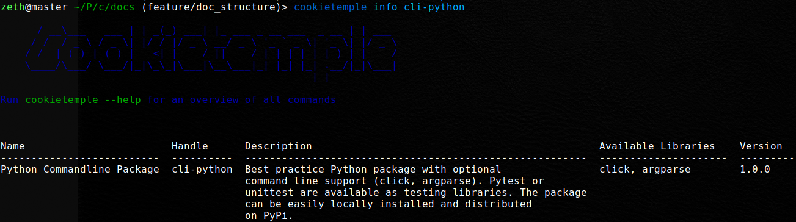

.. _list_info:

=============================================
Getting information about available templates
=============================================

| Although, information on all cookietemple templates is provided in :ref:`available_templates` in our documentation, it is often times more convenient to get a quick overview from the commandline.
| Hence, cookietemple provides two commands :code:`list` and :code:`info`, which print information on all available templates with different levels of detail.

list
-----

cookietemple list can be invoked *via*

.. code-block:: console
    :linenos:

    $ cookietemple list

   Example output of :code:`cookietemple list`. Note that the content of the output is of course subject to change.

:code:`cookietemple list` is restricted to the short descriptions of the templates. If you want to read more about a specific (sets of) template, please use the :ref:`info_f` command.

.. _info_f:

info
------

| The :code:`info` command should be used when the short description of a template is not sufficient and a more detailed description is required.
| Moreover, when you are unsure which template suits you best and you would like to read more about a specific subset of templates further, :code:`info` is your friend.

Invoke :code:`cookietemple info` *via*

.. code-block:: console
    :linenos:

    $ cookietemple info <HANDLE>

   Example output of :code:`cookietemple info`. The handle can also be shortened to e.g. just *cli*, to output all command line templates of COOKIETEMPLE.

It is not necessary to use a full handle such as *cli-python*. Alternatively, a subset of the handle such as *cli* can be used and as a result detailed information on all templates of the requested domain will be printed.
