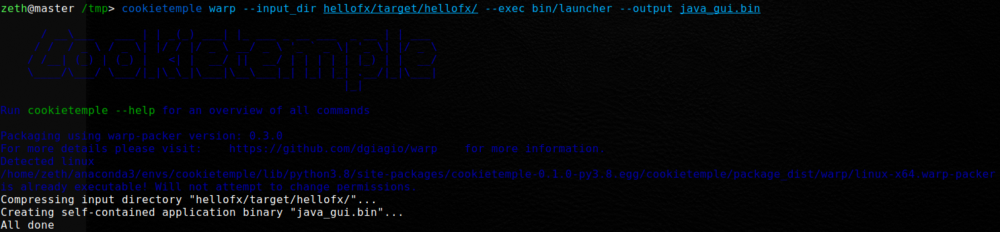

.. _warp_f:

============================
Packaging using warp
============================

| COOKIETEMPLE ships with Rust binaries of `Warp <https://github.com/dgiagio/warp>`_ for the three major operating systems, Linux, MacOS and Windows.
| Warp can be called when complex output scripts with dependencies should be merged into single, distributable binaries.
  An example would be the output of `jlink <https://docs.oracle.com/javase/9/tools/jlink.htm>`_ applied to modular Java projects.
  However, :code:`warp` can also be applied to .NET Core projects, NodeJS and others, making it more flexible than e.g. the with Java 14 introduced JPackager.

Usage
--------

Invoke :code:`warp` by running::

    cookietemple warp --input_dir <INPUTDIR> --exec <EXECUTABLE> --output <OUTPUT>

Please note that the :code:`--exec` operates relative to the packaged folder and may result in 'file not found' errors, if a wrongly relative path is given!

   Example output of :code:`cookietemple warp` applied to a gui-java project. The project was first packaged using :code:`mvn javafx:jlink` and then warp was applied. Please note the relative path for :code:`--exec`.

| The resulting binary is self contained and does not have any additional dependencies. Note however, that the binaries are **not** cross platform. You need to compile and package on the target platform.
| For more information please read the `Warp README <https://github.com/dgiagio/warp>`_.

Warp setup
---------------

| Warp for all major platforms (Linux, Windows 10+, MacOS) is already shipped with COOKIETEMPLE. Hence, there is no need to install the Warp externally.
| However, the first time that you invoke Warp you may be asked for your sudo/administrator password, since the Warp executable needs to be granted executable rights.
  You should only be prompted once, since this setting is permanent. If you update COOKIETEMPLE or reinstall, the Warp executable may be replaced and you once again need to provide it the required rights.
